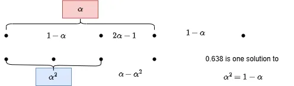

## 线搜索方法

- 精确线搜素：求$\alpha_k$是的目标函数 f 沿方向$d_k$极小，即$f(x_k+\alpha_k d_k)=\min_{\alpha>0}f(x_k+\alpha d_k)$
- 非精确搜索：是指选取$\alpha_k$使得目标函数 f 得到可接受的下降量，即$\Delta f_k=f(x_k)-f(x_k+\alpha_k d_k)>0$是可接受的

精确线搜索的基本思想是:

- 首先确定包含问题最优解的搜索区间,
- 然后采用某种插值或分割技术缩小这个区间,
  进行搜索求解.

### 进退法-单峰区间

#### 定义13
设$\phi$是定义在实数集上一元实函数，$\alpha^* \in [0,+\infty)$，并且
$$\phi(\alpha^*) = \min_{\alpha \geq 0} \phi(\alpha). \tag{2.4}$$

若存在区间$[a,b] \subset [0,+\infty)$，使$\alpha^* \in (a,b)$，则称$[a,b]$是极小化问题$(2.4)$的搜索区间。进一步，若$\alpha^*$使得$\phi(\alpha)$在$[a,\alpha^*]$上严格递减，在$[\alpha^*,b]$上严格递增，则称$[a,b]$是$\phi(\alpha)$的单峰区间，$\phi(\alpha)$是$[a,b]$上的单峰函数。

#### 算法2（进退法）

- 步1 选取 $\alpha_0 \geq 0, h_0 > 0$. 计算 $\phi_0 := \phi(\alpha_0)$. 置 $k := 0$.
- 步2 令 $\alpha_{k+1} = \alpha_k + h_k$, 计算 $\phi_{k+1} := \phi(\alpha_{k+1})$. 若 $\phi_{k+1} < \phi_k$, 转步3, 否则转步4.
- 步3 加大步长. 令 $h_{k+1} := 2h_k, \alpha := \alpha_k, \alpha_k := \alpha_{k+1}, \phi_k := \phi_{k+1}, k := k + 1$, 转步2.
- 步4 反向搜索或输出. 若 $k = 0$, 令 $h_1 := h_0, \alpha := \alpha_1, \alpha_1 := \alpha_0, \phi_1 := \phi_0, k := 1$, 转步2; 否则停止迭代, 令
$$a = \min\{\alpha, \alpha_{k+1}\},\quad b = \max\{\alpha, \alpha_{k+1}\}.$$
输出 $[a,b]$.

### 黄金分割法-线性收敛

由于每次迭代搜索区间的收缩率是 𝑡 = 0.618, 故 0.618 法只
是线性收敛的, 即这一方法的计算效率并不高. 但该方法每次迭代只需计算一次
函数值的优点足以弥补这一缺憾

$$
\begin{gather*}
ax=(1-a)x(1-a)\\
a=\frac{3-\sqrt{5}}{2}\\
1-a\approx 0.618\\
\end{gather*}
$$

#### 算法3 (0.618法)

**步0** 确定初始搜索区间 $[a_0,b_0]$ 和容许误差 $\varepsilon > 0$. 计算初始试探点
$$p_0 = a_0 + 0.382(b_0 - a_0),\quad q_0 = a_0 + 0.618(b_0 - a_0)$$
及相应的函数值 $\phi(p_0), \phi(q_0)$. 置 $i := 0$.

**步1** 若 $\phi(p_i) \leq \phi(q_i)$, 转步2; 否则, 转步3.

**步2** 计算左试探点. 若 $|q_i - a_i| \leq \varepsilon$, 停算, 输出 $p_i$. 否则, 令
$$a_{i+1} := a_i,\quad b_{i+1} := q_i,\quad \phi(q_{i+1}) := \phi(p_i),$$
$$q_{i+1} := p_i,\quad p_{i+1} := a_{i+1} + 0.382(b_{i+1} - a_{i+1}).$$
计算 $\phi(p_{i+1})$, $i := i + 1$, 转步1.

**步3** 计算右试探点. 若 $|b_i - p_i| \leq \varepsilon$, 停算, 输出 $q_i$. 否则, 令
$$a_{i+1} := p_i,\quad b_{i+1} := b_i,\quad \phi(p_{i+1}) := \phi(q_i),$$
$$p_{i+1} := q_i,\quad q_{i+1} := a_{i+1} + 0.618(b_{i+1} - a_{i+1}).$$
计算 $\phi(q_{i+1})$, $i := i + 1$, 转步1.

### 牛顿法与割线法

牛顿法使用迭代点的值、导数值、二阶导数值。割线法使用之前点与现点的一阶导数值差分替代牛顿法的二阶导数法。牛顿法证明要求二次连续可微，割线法要求三次。

牛顿法的优缺点

- 优点：超线性收敛、有时二次收敛
- 缺点：
  - 找到的是一阶导数为零的点，**有时不能收敛**到极小值点（可能收敛到极大值点）
  - 需要计算一阶导数和二阶导数，**计算量大**

$$
\begin{aligned}
f(x)&\approx f(x_k)+f'(x_k)(x-x_k)+\frac{f''(x_k)}{2}(x-x_k)^2=\hat{f}(x)\\
\hat{f}'(x)&=f'(x_k)+f''(x_k)(x-x_k)\\
let\ &\hat{f}'(x)=0:\
x_{k+1}=x_k-\frac{f'(x_k)}{f''(x_k)}
\end{aligned}
$$

#### 算法2.1.1（牛顿法）
**步1** 给定初始点 \( x_1 \in \mathbb{R} \)，令迭代次数 \( k:=1 \)。
**步2** 计算函数在当前点的一阶导数 \( f'(x_k) \) 和二阶导数 \( f''(x_k) \)。
**步3** 若 \( f'(x_k) = 0 \)，则算法终止；否则，按如下公式更新迭代点：
\[ x_{k+1} = x_k - \frac{f'(x_k)}{f''(x_k)} \]
更新迭代次数 \( k:=k+1 \)，返回步2。

#### 割线法

$$
\begin{aligned}
f''(x_k)&\approx \frac{f'(x_k)-f'(x_{k-1})}{x_k-x_{k-1}}\\
x_{k+1}&=x_k-\frac{{f}'(x_k)}{f''(x_k)}
=x_k-\frac{{f}'(x_k)(x_k-x_{k-1})}{f'(x_k)-f'(x_{k-1})}
\end{aligned}
$$

### 抛物线法

书上方法不好的原因是他的方法浪费了上一步的计算。
抛物线法老师讲解的和书上的不一样，书上是任意找一个点，而老师是讲的用黄金分割的方法找两个点，用其中满足高低高的三个点确定另一个点。

首先考虑在$x_k$，$x_{k-1}$，$x_{k-2}$三点的二次插值函数：

$$
\hat{f}(x)=f(x_k)
  +(x-x_k)f(x_k,x_{k-1})
  +(x-x_{k})(x-x_{k-1})f(x_{k},x_{k-1},x_{k-2})
$$

其中：一阶差商$f(x_k,x_{k-1})=\frac{f(x_k)-f(x_{k-1})}{x_k-x_{k-1}}$，二阶差商$f(x_k,x_{k-1},x_{k-2})=\frac{f(x_k,x_{k-1})-f(x_{k-1},f_{k-2})}{x_k-x_{k-2 }}$。

设$f(x_k,x_{k-1},x_{k-2})\neq 0$，令$x_{k+1}$是上面方程的稳定点（可以化为一般形式利用抛物线顶点算，也可以求导令导数为零），即得到迭代法：

$$
\begin{aligned}
x_{k+1}=\frac{x_{k}+x_{k-1}}{2}-\frac{f(x_k,x_{k-1})}{2f(x_k,x_{k-1},x_{k-2})}
\end{aligned}
$$

### 算法2.3.2（抛物线法）

**步1** 给出 $x_0 \in \mathbb{R}$, $\varepsilon > 0$, 由算法2.3.1产生 $x_1, x_2, x_3$.

**步2** 如果 $\min\{|x_2 - x_1|, |x_3 - x_1|\} \leq \varepsilon$ 则停；
由公式 (2.3.4) 计算 $x_4$.

**步3** 如果 $f(x_4) < f(x_1)$ 则转步5；
如果 $f(x_4) > f(x_1)$ 则转步6.

**步4** （如果$f(x_4) = f(x_1)$，时需要改变$x_4$使得可以进行步3） $\hat{x}:=(x_4 + x_1)/2$;
如果 $\hat{x}=x_1$, $\hat{x}:=(x_2 + x_1)/2$;
如果 $f(\hat{x}) = f(x_1)$ 则 $x_4:=\hat{x}$ 及转步4;
$x_4:=\hat{x}$, 转步3.

**步5** 如果 $(x_4 - x_1)(x_3 - x_1) > 0$ 则 $x_2:=x_1$, 否则 $x_3:=x_1$;
$x_1:=x_4$, 转步2.

**步6** 如果 $(x_4 - x_1)(x_3 - x_1) > 0$ 则 $x_3:=x_4$, 否则 $x_2:=x_4$;
转步2.

### 非精确线搜索方法

为什么要使用非精确线搜索：

1. 精确线搜索需要计算很多的函数值和梯度值，从而**耗费较多的计算资源**。
2. 当迭代点远离最优点时，精确线搜索通常**不是十分有效和合理**的。
3. 对于许多优化算法，其**收敛速度**并不依赖于精确搜索过程。
4. 既能保证目标函数具有**可接受的下降量**又能**使最终形成的迭代序列收敛**的非精确线搜索变得越来越流行。

**Wolfe 准则**：给定$\rho\in(0,0.05)$，$\sigma\in(\rho,0.5)$,求使得下面两个不等式成立：

1. 函数值有一定下降量$f(x_k+\alpha_k d_k)\le f(x_k)+\rho \alpha_k g_k^T d_k$
2. 函数近似解上的函数梯度较小$\nabla f(x_k+\alpha_k d_k)^T d_k\geq \sigma g_k^T d_k$

其中$g_k=g(x_k)=\nabla f(x_k)$。条件二有时有一个更强的条件$|\nabla f(x_k+\alpha_k d_k)^T d_k| \leq -\sigma g_k^T d_k$。
由于 $𝑔_𝑘^𝑇 𝑑_𝑘 < 0$, 可以证明 Wolfe 准则的**有限终止性**, 即步长 $\alpha_𝑘$ 的存在性.

**Armijo 准则**：给定$\beta\in(0,1)$,$\sigma\in(0,0.5)$。令步长因子$\alpha_k=\beta^{m_k}$，其中$m_k$是满足下列不等式的最小非负整数。

$$
f(x_k+\beta^m d_k) \leq f({x_k})+\sigma \beta^mg_k^T d_k \tag{2.13}
$$

可以证明, 若 𝑓(𝑥) 是连续可微的且满足 $𝑔_𝑘^𝑇 𝑑_𝑘 < 0$, 则 Armijo 准则是有限终止的, 即存在正数 𝜎, 使得对于充分大的正整数 𝑚, (2.13) 式成立.

### 线搜索的收敛性

梯度收敛到零需要满足，搜索方向$d_k$与负梯度$-\nabla$的夹角为**锐角**，即为：

$$
0\leq \theta_k \leq \frac{\pi}{2} - \mu,\mu\in(0,\frac{\pi}{2}),
\cos\theta_k=\frac{-g_k^T d_k}{\Vert g_k \Vert \Vert d_k \Vert}
$$

#### 算法6（线搜索算法框架）
**步0（初始化）**：选取相关参数及初始迭代点 \( x_0 \in \mathbb{R}^n \)，设定容许误差 \( \varepsilon \ll 1 \)，令 \( k:=0 \)。

**步1（终止判别）**：计算梯度 \( g_k = \nabla f(x_k) \)，若 \( \|g_k\| \leq \varepsilon \)，输出近似最优解 \( x^* \approx x_k \)，算法终止。

**步2（确定下降方向）**：确定下降方向 \( d_k \)，满足 \( g_k^T d_k < 0 \)。

**步3（确定步长因子 \( \alpha_k \)）**：从以下两种线搜索技术中选择其一：
1. **精确线搜索**：用0.618法或二次插值法等，求
   \[
   \alpha_k = \arg\min_{\alpha>0} f(x_k + \alpha d_k) \tag{2.14}
   \]
2. **非精确线搜索**：用Wolfe准则或Armijo准则等，求 \( \alpha_k \)。

**步4（更新迭代点）**：令 \( x_{k+1} := x_k + \alpha_k d_k \)，\( k:=k+1 \)，转步1。

#### 定理11
设\(\{x_k\}\)是由算法6产生的序列，若函数\(f(x)\)有下界，且对任意初始点\(x_0 \in \mathbb{R}^n\)，梯度\(\nabla f(x)\)在水平集
\[
L(x_0) = \left\{ x \in \mathbb{R}^n \mid f(x) \leq f(x_0) \right\}
\]
上存在且一致连续，同时下降方向\(d_k\)满足条件(2.15)，则：
1. 采用Wolfe准则求搜索步长\(\alpha_k\)时，有\( \|g_k\| \to 0\ (k \to \infty) \)；
2. 采用Armijo准则求搜索步长\(\alpha_k\)时，\(\{x_k\}\)的任何聚点\(x^*\)都满足\( \nabla f(x^*) = 0 \)。

#### 定理12

设\(\{x_k\}\)是由算法6产生的序列，若函数\(f(x)\)有下界，且对任意初始点\(x_0 \in \mathbb{R}^n\)，梯度\(\nabla f(x)\)在水平集
\[ L(x_0) = \left\{ x \in \mathbb{R}^n \mid f(x) \leq f(x_0) \right\} \]
上存在且一致连续；同时下降方向\(d_k\)满足条件(2.15)，搜索步长\(\alpha_k\)满足精确线搜索条件(2.14)，则：
若非\(g_k = 0\)，必有\(g_k \to 0\ (k \to \infty)\)（其中\(g_k\)通常表示\(\nabla f(x_k)\)）。

