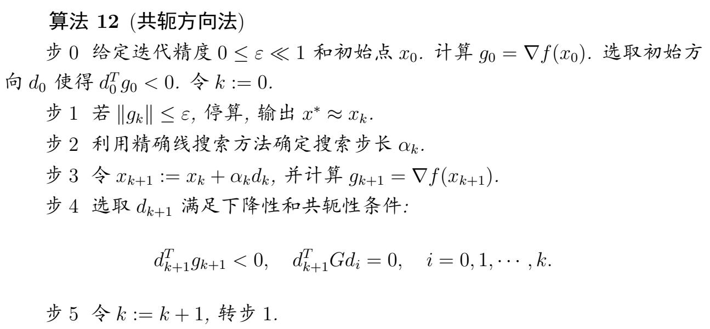

## 多维优化问题

### 梯度法（最速下降法）

“最速” 是指当前迭代点的局部方向上的瞬时下降最快，而非全局收敛速度最快；线性收敛是该方法的全局收敛速率，与局部最速下降的定义不矛盾。

$d_k=-g_k=-\nabla f(x_k)$，

- 优点：实现简单，不依赖 hesse 矩阵
- 缺点：线性收敛（**一次拟合**，误差为一次高阶项）

#### 算法7（最速下降法）
**步0（初始化）**：选取初始点 \( x_0 \in \mathbb{R}^n \)，设定容许误差 \( 0 \leq \varepsilon \ll 1 \)，令迭代次数 \( k:=1 \)。

**步1（终止判别）**：计算梯度 \( g_k = \nabla f(x_k) \)，若 \( \|g_k\| \leq \varepsilon \)，算法终止，输出 \( x_k \) 作为近似最优解。

**步2（确定搜索方向）**：取下降方向 \( d_k = -g_k \)（负梯度方向）。

**步3（确定步长因子）**：通过线搜索技术确定步长 \( \alpha_k \)。

**步4（更新迭代点）**：令 \( x_{k+1} := x_k + \alpha_k d_k \)，更新迭代次数 \( k:=k+1 \)，返回步1。

### 牛顿法

- 基本牛顿法：$g_k+G_k d_k=0,(\Vert g_k(x_{k+1})\Vert =0)$ 收敛性至少是二阶的(局部二阶收敛性)
- 阻尼牛顿法：基本牛顿法需要初始点**足够“靠近”极小点**，否则有可能导致算法不收敛（可能收敛到极大值点或鞍点）。可以沿着$d_k$方向精确线搜索，从而克服这个困难。阻尼牛顿法也是超线性收敛
- 基本、阻尼牛顿法需要每一步**hesse 矩阵正定**。改进：
  - 牛顿-最速下降混合算法：当$\nabla^2 f(x_k)$正定 时，采用牛顿法作为搜索方向；否则，若$\nabla^2 f(x_k)$奇异，或者虽然非奇异但是牛顿方向不是下降方向，则采用负梯度方向作为搜索方向
  - 修正牛顿法：克服这一缺陷还有其它的方法和途径. 例如, 引进阻尼因子 $\mu_𝑘\geq 0$, 即在每一迭代步适当地选取参数 $\mu_𝑘$ 使得矩阵 $𝐴_𝑘 = 𝐺(𝑥𝑘) + \mu_𝑘𝐼$ 正定.
- 牛顿法需要算 hesse 矩阵，**计算量大**，由此产生了拟牛顿法。

### 共轭方向法

共轭方向法的基本思想是在求解 𝑛 维正定二次目标函数极小点时产生一组共轭方向作为搜索方向, 在精确线搜索条件下算法至多迭代 𝑛 步即能求得极小点.
经过适当的修正后共轭方向法可以推广到求解一般非二次目标函数情形。

#### G 共轭

定义一种新的内积$x\cdot y=xGy$称为相互 G 共轭，内积需要满足性质：

1. $x\cdot y\ge0$ ，$x\cdot x=0$ if and only if $x=0$
2. 线性性质：$(x+y)\cdot z=x\cdot z+y\cdot z$以及$(ax)\cdot y=a(x\cdot y)$
3. 对称性质：$x\cdot y=y\cdot x$

对于求矩阵的共轭方向，除了“直接构造法”，还可以通过**特征向量法**或**Gram-Schmidt正交化（推广到共轭）**来实现，以下是具体方法：

#### 方法1：特征向量法（对称正定矩阵的特征向量天然共轭）
对于对称正定矩阵 \( M \)，其**不同特征值对应的特征向量是 \( M \)-共轭的**（证明：若 \( M\boldsymbol{v}_i = \lambda_i \boldsymbol{v}_i \)，则 \( \boldsymbol{v}_i^T M \boldsymbol{v}_j = \lambda_j \boldsymbol{v}_i^T \boldsymbol{v}_j = 0 \)，因特征向量正交）。

#### 方法2：推广的Gram-Schmidt共轭化（从任意向量组构造）
任取一组线性无关的向量 \( \boldsymbol{x}_1, \boldsymbol{x}_2, \dots \)，通过“共轭化”得到 \( M \)-共轭向量：
1. 令 \( \boldsymbol{d}_1 = \boldsymbol{x}_1 \)；
2. 对 \( k \geq 2 \)，令 \( \boldsymbol{d}_k = \boldsymbol{x}_k - \sum_{i=1}^{k-1} \frac{\boldsymbol{x}_k^T M \boldsymbol{d}_i}{\boldsymbol{d}_i^T M \boldsymbol{d}_i} \boldsymbol{d}_i \)。

### 二次终止性

定理 21 说明：当使用精确线搜索方法时，对于正定二次目标函数极小值问题，共轭方向阀至多在 n 步内即可求得其唯一极小点，这称为**二次终止性**。

$$
\begin{gather*}
f(x)=\frac{1}{2}x^TGx+b^Tx+c\\
g(x)=Gx+b\\
x^\star=-G^{-1}b
\end{gather*}
$$

### 共轭梯度法

共轭梯度法是一种共轭方向法，他取初始搜索方向为初始梯度方向。
但是仅将初始梯度方向取为初始搜索方向，共轭方向法中仍然需要计算 hesse 矩阵，而共轭梯度法不需要计算 hesse 矩阵 G。

搜索方向的求解方法：Gram-Schmidt 正交化方法，该方法可以求取空间的一组正交基。

$$
d_k=0g_k+\beta_{k-1}d_{k-1}+\sum_{i=0}^{k-2}\beta_k^id_i
$$

为了确定$\beta$，就利用$d_k^TGd_i=0,i=0,\cdots,k-1$。k 个等式确定 k 个未知数，即可求得$\beta$。
继续变化，可以消除 G 的需求，由搜索方向的结构可知：$g_k^Tg_i=0,i=0\dots k-1$

$$
\begin{split}
from:\ &0=d_{k-1}^TGd_k\\
\beta_{k-1}=&
\frac{g_k^T G d_{k-1}}{d_{k-1}^T G d_{k-1}}
=\frac{g_k^T(g_{k}-g_{k-1})}{d_{k-1}^T (g_{k}-g_{k-1})}\\
=&\frac{g_k^Tg_{k}}{-d_{k-1}^T g_{k-1}}
=\textcolor{red}{\frac{g_k^Tg_{k}}{g_{k-1}^T g_{k-1}}}\\
\end{split}
$$

对于非二次目标函数（即更一般的非线性目标函数）极小值问题，
共轭梯度法不具有二次终止性。 但是收敛很快，因为：随着迭代的步数增加，迭代点很贴近目标点，那么拟合的二次函数与目标函数的误差很小。

### 拟牛顿方法

拟牛顿法的基本思想是在基本牛顿法的步 2 中用 Hesee 阵 $𝐺𝑘 = ∇^2𝑓(𝑥_𝑘) $的某个近似矩阵 𝐵𝑘 取代 𝐺𝑘.
通常，这个$B_k$应具有下面的三个特点：

1. 在某种意义下有$B_k\approx G$，使得相应的算法产生的方向**接近于牛顿方向**，以确保算法具有较快的收敛速度。
2. 对所有的 k，$B_k$是**对称正定**的，从而使得算法所产生的防线是函数 f 在$x_K$处的下降方向。
3. $B_k$的更新规则比较简单，**计算量不大**，以便在实际应用中使用。

$$
\begin{split}
s_k=x_{k+1}-x_{k}\\
y_k=g_{k+1}-g_{k}\\
G_{k+1}s_k\approx y_k
\end{split}
$$

定义$H_{k+1}=B_{k+1}^{-1}$，可以得到

- **拟牛顿条件**：$B_{k+1}s_k=y_k,H_{k+1}y_k=s_k$
- **校正公式**：$B_{k+1}=B_k+E_k,H_{k+1}=H_k+D_k$
- **对称秩一校正**：$E_k=\alpha u_k u_k^T$

$$
B_{k+1}=B_{k}+\frac{(y_k-B_ks_k)(y_k-B_ks_k)^T}{(y_k-B_ks_k)^T s_k}
$$

$$
H_{k+1}=H_{k}+\frac{(s_k-H_k y_k)(s_k-H_ky_k)^T}{(s_k-H_k y_k)^T y_k}
$$

### 秩二校正

$$
E_k=\alpha u_k u_k^T+\beta v_k v_k^T
$$

### BFGS 方法

$$
B_{k+1}=B_k-\frac{B_k s_k s_k^T B_k}{s_k^T B_k s_k}+\frac{y_k y_k^T}{y_k^T s_k} .
$$

#### 算法15（BFGS算法）

**步0** 给定参数 \( \delta \in (0,1) \)，\( \sigma \in (0,0.5) \)，初始点 \( x_0 \in \mathbb{R}^n \)，终止误差 \( 0 \leq \varepsilon \ll 1 \)。初始对称正定阵 \( B_k \)（通常取 \( G(x_0) \) 或单位阵 \( I_n \)），令 \( k:=0 \)。

**步1** 计算 \( g_k = \nabla f(x_k) \)，若 \( \|g_k\| \leq \varepsilon \)，停算，输出 \( x_k \) 作为近似极小点。

**步2** 解线性方程组 \( B_k d = -g_k \) 得解 \( d_k \)（式5.12）。

**步3** 设 \( m_k \) 是满足不等式 \( f(x_k + \delta^{m_k} d_k) \leq f(x_k) + \sigma \delta^{m_k} g_k^T d_k \) 的最小非负整数 \( m \)（式5.13），令 \( \alpha_k = \delta^{m_k} \)，\( x_{k+1} = x_k + \alpha_k d_k \)。

**步4** 由校正公式(5.11)确定 \( B_{k+1} \)。

**步5** 令 \( k:=k+1 \)，转步1。

若初始矩阵 𝐵0 对称正定且在迭代过程中保持 𝑦𝑘𝑇𝑠𝑘 >
0, ∀ 𝑘 ≥ 0, 则由 BFGS 校正公式产生的矩阵序列 {𝐵𝑘} 是对称正定的. 从而方程
组 𝐵𝑘𝑑 = −𝑔𝑘 有唯一解 𝑑𝑘, 且 𝑑𝑘 是函数 𝑓 在 𝑥𝑘 处的下降方向.

### DFP 方法

$$
H_{k+1}=H_k-\frac{H_k y_k y_k^T H_k}{y_k^T H_k y_k}+\frac{s_k s_k^T}{s_k^T y_k}
$$

#### 算法16（DFP算法）

- **步0** 给定参数 \( \delta \in (0,1) \)，\( \sigma \in (0,0.5) \)，初始点 \( x_0 \in \mathbb{R}^n \)，终止误差 \( 0 \leq \varepsilon \ll 1 \)。初始对称正定阵 \( H_0 \)（通常取 \( G(x_0)^{-1} \) 或单位阵 \( I_n \)），令 \( k:=0 \)。
- **步1** 计算 \( g_k = \nabla f(x_k) \)，若 \( \|g_k\| \leq \varepsilon \)，停算，输出 \( x_k \) 作为近似极小点。
- **步2** 计算搜索方向 \( d_k = -H_k g_k \)（式5.16）。
- **步3** 设 \( m_k \) 是满足不等式 \( f(x_k + \delta^{m_k} d_k) \leq f(x_k) + \sigma \delta^{m_k} g_k^T d_k \) 的最小非负整数 \( m \)（式5.17），令 \( \alpha_k = \delta^{m_k} \)，\( x_{k+1} = x_k + \alpha_k d_k \)。
- **步4** 由校正公式(5.15)确定 \( H_{k+1} \)。
- **步5** 令 \( k:=k+1 \)，转步1。

### broyden 族

$$
\begin{aligned}
B_{k+1}^\theta & =\theta_k B_{k+1}^{\mathrm{DFP}}+\left(1-\theta_k\right) B_{k+1}^{\mathrm{BFGS}} \\
& =B_k-\frac{B_k s_k s_k^T B_k}{s_k^T B_k s_k}+\frac{y_k y_k^T}{s_k^T y_k}+\theta_k u_k u_k^T\\
u_k=\sqrt{s_k^T B_k s_k}\left(\frac{y_k}{y_k^Ts_k}-\frac{B_ks_k}{s^TB_ks_k}\right)
\end{aligned}
$$

$$
\begin{aligned}
H_{k+1}^\phi & =\phi_k H_{k+1}^{\mathrm{BFGS}}+\left(1-\phi_k\right) H_{k+1}^{\mathrm{DFP}} \\
& =H_k-\frac{H_k y_k y_k^T H_k}{y_k^T H_k y_k}+\frac{s_k s_k^T}{s_k^T y_k}+\phi_k v_k v_k^T
u_k=\sqrt{y_k^T H_k y_k}\left(\frac{s_k}{y_k^Ts_k}-\frac{H_ky_k}{y^TH_ky_k}\right)
\end{aligned}
$$

#### 算法17（Broyden族算法）

**步0** 给定参数 \( \delta \in (0,1) \)，\( \sigma \in (0,0.5) \)，\( \phi \in [0,1] \)，初始点 \( x_0 \in \mathbb{R}^n \)，终止误差 \( 0 \leq \varepsilon \ll 1 \)。初始对称正定阵 \( H_0 \)（通常取 \( G(x_0)^{-1} \) 或单位阵 \( I_n \)），令 \( k:=0 \)。

**步1** 计算 \( g_k = \nabla f(x_k) \)，若 \( \|g_k\| \leq \varepsilon \)，停算，输出 \( x_k \) 作为近似极小点。

**步2** 计算搜索方向 \( d_k = -H_k g_k \)（式5.29）。

**步3** 设 \( m_k \) 是满足不等式 \( f(x_k + \delta^{m_k} d_k) \leq f(x_k) + \sigma \delta^{m_k} g_k^T d_k \) 的最小非负整数 \( m \)（式5.30），令 \( \alpha_k = \delta^{m_k} \)，\( x_{k+1} = x_k + \alpha_k d_k \)。

**步4** 由校正公式确定 \( H_{k+1} \)：
\[
H_{k+1} =
\begin{cases}
H_k, & \text{若 } s_k^T y_k \leq 0, \\
H_k - \frac{H_k y_k y_k^T H_k}{y_k^T H_k y_k} + \frac{s_k s_k^T}{s_k^T y_k} + \phi \nu_k \nu_k^T, & \text{若 } y_k^T s_k > 0
\end{cases}
\]（式5.31）

**步5** 令 \( k:=k+1 \)，转步1。

- broyden 组算法求解及消化二次目标函数的时候具有二次终止性

