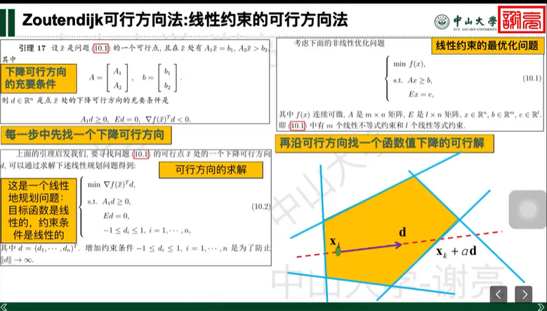
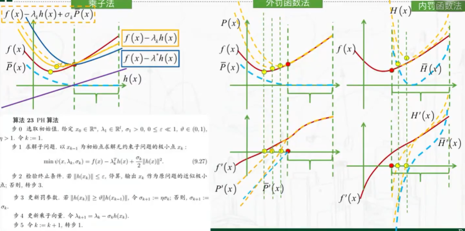

## 约束优化问题

### 可行方向法

**可行方向法**的定义为: 在求解约束优化问题时,若已知$x_k$是满足约束的解，则方向 d 为可行方向指的是，从 $x_k$ 出发，沿着 d 方向作微小移动后，可以得到一个新的点$x_{k+1}$，该点仍然满足约束条件。

**下降可行方向**的定义为：d 是可行方向，且沿 d 运动一个微小距离，目标值是下降的。

约束问题的可行方向法：

1. 迭代求解
2. 每一步先找一个下降可行方向
3. 再沿着下降可行方向找一个函数值下降的可行解

将寻找可行方向转换为线性规划问题，然后用线性规划的方法求解。
$\alpha$限制范围为 $[0,\bar{\alpha}]$，$\bar{\alpha}=\max \{\alpha | x_k+\alpha d_k \in F\}=\max\{A_2(x_k+\alpha d_k)>b_2\}$。

- Zoutendijk 可行方向法是一种基于牛顿法的可行方向法，它在牛顿法的基础上加入了对约束条件的判断，从而保证迭代点总是满足所有的约束条件.

#### 投影梯度法

投影梯度法是一种基于梯度法的可行方向法，它在梯度法的基础上加入了对约束条件的判断，从而保证迭代点总是满足所有的约束条件.

称矩阵$P\in \reals$

### 罚函数法

罚函数的优势为：不需要求解子问题，只需要求解原问题，因此计算量小，但是需要对原问题进行修改。可以将带约束问题转换为不带约束的问题。

目标：
$$\min f(\vec{x})$$
约束条件：
1. 等式约束：$h_i(\vec{x}) = 0 \quad (i=1,2,\dots,l)$
2. 不等式约束：$g_i(\vec{x}) > 0 \quad (i=1,2,\dots,m)$

#### 外罚函数法

##### 罚函数与增广目标函数

1. 记可行域为\( \mathcal{D} = \{x \in \mathbb{R}^n | h_i(x) = 0 (i \in E), g_i(x) \geq 0 (i \in I)\} \)。
2. **罚函数**：
$$\bar{P}(\vec{x}) = \sum_{i=1}^l h_i^2(\vec{x}) + \sum_{i=1}^m \left[ \min(0, g_i(\vec{x})) \right]^2$$
   - 当$\vec{x}$在**可行域内**时，罚函数值$\bar{P}(\vec{x})=0$；
   - 当$\vec{x}$远离可行域时，罚函数值随偏离程度增大而增大。
3. **增广目标函数**（将约束问题转化为无约束问题）：
$$P(\vec{x}, \sigma) = f(\vec{x}) + \sigma \bar{P}(\vec{x})$$
其中，$\sigma$称为**罚参数**（需满足$\sigma > 0$）。

##### 核心逻辑

1. 罚参数$\sigma$的作用：
   - $\sigma$越大，$\sigma\bar{P}(\vec{x})$的“惩罚力度”越强；
   - 要使$P(\vec{x}, \sigma)$达到极小，需让$\sigma\bar{P}(\vec{x})$尽可能小，即$\bar{P}(\vec{x})$尽可能小→$\vec{x}$趋近于可行域。
2. 求解思路：
通过选取**逐渐增大的罚参数序列**$\{\sigma_k\}$（满足$\sigma_k > 0$且$\sigma_k \to +\infty$），求解无约束优化问题：
$$\min P(\vec{x}, \sigma_k)$$
当$\sigma_k$足够大时，该无约束问题的极小解近似等价于原约束问题的极小解。

##### 算法21 (外罚函数法)
步0 给定初始点\( x_0 \in \mathbb{R}^n \)，终止误差\( 0 \leq \varepsilon \ll 1 \)，\( \sigma_1 > 0 \)，\( \gamma > 1 \)。令\( k:=1 \)。
步1 以\( x_{k-1} \)为初始点求解子问题
\[
\min_{x \in \mathbb{R}^n} P(x, \sigma_k) = f(x) + \sigma_k \bar{P}(x). \tag{9.4}
\]
令其极小点为\( x_k \)。
步2 若\( \sigma_k \bar{P}(x_k) \leq \varepsilon \)，停算，输出\( x^* \approx x_k \)作为近似极小点。
步3 令\( \sigma_{k+1}:= \gamma \sigma_k \)，\( k:=k+1 \)，转步1。

##### 罚函数优缺点

罚函数法**优点**：

- 结构简单, 可以直接调用无约束优化算法的通用程序, 因而容易编程实现。

**缺点**是:

1. 要求每一步找**全局极小值**点
2. $𝑥_𝑘$ 往往**不是可行点**, 这对于某些实际问题是难以接受的;（内点法解决这个问题）
3. **罚参数** $\sigma_k$ 的**选取比较困难**, 取的过小, 可能起不到“惩罚”的作用, 而取得过大则可能造成 𝑃(𝑥, 𝜎𝑘) 的 Hesse 阵的病态，条件数很大, 从而带来数值技术上的困难;
4. 注意到 $\bar{𝑃}(𝑥)$ 一般是**不可微**的, 因而难以直接使用利用导数的优化算法, 从而收敛速度缓慢.

#### 内点法

##### 算法22 (内点法)

- 步0 给定初始点\( x_0 \in D_0 \)，终止误差\( 0 \leq \varepsilon \ll 1 \)，\( \tau_1 > 0 \)，\( \rho \in (0,1) \)。令\( k:=1 \)。
- 步1 以\( x_{k-1} \)为初始点求解无约束子问题\((9.13)\)，得极小点\( x_k \)。
- 步2 若\( \tau_k \bar{H}(x_k) \leq \varepsilon \)，停算，输出\( x^* \approx x_k \)作为近似极小点。
- 步3 令\( \tau_{k+1}:= \rho \tau_k \)，\( k:=k+1 \)，转步1。

##### 不等式约束的情况

内点法**仅适用于不等式约束的优化问题**，形式为：
$$
\begin{cases}
\min \quad f(x), \quad x \in \mathbb{R}^n \\
\text{s.t.} \quad g_i(x) \geq 0, \quad i=1,\dots,m
\end{cases}
$$

将约束问题转化为无约束优化问题，核心是引入**障碍函数**和**障碍参数**$\tau_k$，构造增广目标函数：
$$\min \quad H(x,\tau_k) = f(x) + \tau_k \tilde{H}(x)$$

其中，常用的障碍函数$\tilde{H}(x)$有两种形式：
1. 对数形式：$\tilde{H}(x) = -\sum_{i=1}^m \ln(g_i(x))$
2. 倒数形式：$\tilde{H}(x) = \sum_{i=1}^m \frac{1}{g_i(x)}$

步骤如下：
1. **初始化**：
   - 给定**初始内点**$x_0 \in D_0$（$D_0$是可行域内部）；
   - 设定终止误差$\varepsilon \geq 0$、初始障碍参数$\tau_1 > 0$、收缩因子$\sigma \in (0,1)$；
   - 令迭代次数$k=1$。
2. **求解无约束子问题**：
   以$x_{k-1}$为初始点，求解无约束问题$\min H(x,\tau_k)$，得到极小点$x_k$。
3. **终止判断**：
   若$\tau_k \tilde{H}(x_k) \leq \varepsilon$，停止迭代，输出$x^* \approx x_k$作为近似极小点。
4. **更新参数，循环迭代**：
   令$\tau_{k+1} = \sigma \tau_k$，$k=k+1$，回到步骤2。

##### 含等式约束的情况

外罚函数处理等式约束，内点法处理不等式约束可以使用如下算法，但是初始点的选取是问题（老师说不是什么问题，初始点要在内点里面）：

现在,我们考虑一般约束优化问题
\[
\left\{
\begin{aligned}
&\min f(x), \quad\ \ x \in \mathbb{R}^n, \\
&\text{s.t. } h_i(x) = 0, \ i = 1,\cdots,l, \\
&\quad\ \ \ g_i(x) \geq 0, \ i = 1,\cdots,m
\end{aligned}
\right. \tag{9.16}
\]

内点法特征的罚函数方法. 途径之一是对于等式约束利用“外罚函数”的思想,
而对于不等式约束则利用“障碍函数”的思想, 构造出所谓混合增广目标函数
\[
H(x,\mu) = f(x) + \frac{1}{2\mu} \sum_{i=1}^l h_i^2(x) + \mu \sum_{i=1}^m \frac{1}{g_i(x)}, \tag{9.17}
\]
或
\[
H(x,\mu) = f(x) + \frac{1}{2\mu} \sum_{i=1}^l h_i^2(x) - \mu \sum_{i=1}^m \ln [g_i(x)]. \tag{9.18}
\]

解决方案有，引入松弛变量：
另一种途径是, 引入松弛变量\( y_i, \ i = 1,\cdots,m \), 将问题等价地转化为
\[
\left\{
\begin{aligned}
&\min f(x), \quad\quad\ \ x \in \mathbb{R}^n, \\
&\text{s.t. } h_i(x) = 0, \quad\ \ i = 1,\cdots,l, \\
&\quad\ \ \ g_i(x) - y_i = 0, \ i = 1,\cdots,m, \\
&\quad\ \ \ y_i \geq 0, \quad\quad\ i = 1,\cdots,m.
\end{aligned}
\right. \tag{9.19}
\]

然后构造等价问题\((9.19)\)的混合增广目标函数:
\[
\psi(x,y,\mu) = f(x) + \frac{1}{2\mu} \sum_{i=1}^l h_i^2(x) + \frac{1}{2\mu} \sum_{i=1}^m \left[g_i(x) - y_i\right]^2 + \mu \sum_{i=1}^m \frac{1}{y_i}, \tag{9.20}
\]
或
\[
\psi(x,y,\mu) = f(x) + \frac{1}{2\mu} \sum_{i=1}^l h_i^2(x) + \frac{1}{2\mu} \sum_{i=1}^m \left[g_i(x) - y_i\right]^2 - \mu \sum_{i=1}^m \ln y_i. \tag{9.21}
\]

在此基础上, 类似于前面的外罚函数法与内点法的算法框架, 可以建立起相应的
求解算法. 值得说明的是, 此时, 任意的\( (x,y),\ y > 0 \)均可作为一个合适的初始点
来启动相应的迭代算法.

##### 内点法的缺点：

1. 单纯的内点法不适用于等式约束
2. 随着迭代，罚参数越来越小，惩罚函数的病态程度雨来越大，迭代容易失败

#### 乘子法

乘子法是 Powell 和 Hestenes 于 1969 年针对等式约束优化问题同时独立提出的一种优化算法, 后于 1973 年经 Rockfellar 推广到求解不等式约束优化问题. 其基本思想是从原问题的拉格朗日函数出发, 再加上适当的罚函数, 从而将原问题转化为求解一系列的无约束优化子问题. 由于外罚函数法中的罚参数$\sigma_k\to\infty$, 因此增广目标函数变得“越来越病态”. 增广目标函数的这种**病态性质是外罚函数法的主要缺点**, 而这种缺陷在乘子法中由于引入拉格朗日函数及加上适当的罚函数而得以有效的克服.

##### PHR 算法

- 步 0：选取初始值，给定$x_o\in \reals^n$，$\mu_1\in\reals^l$，$\lambda_1\in\reals^m$，$\sigma_1>0$，$0\leq\epsilon\ll 1$，$\vartheta\in(0,1),\eta>1$，令$k:=1$.
- 步 1：求解子问题。以$x_{k-1}$为初始点求解无约束子问题$\min \psi(x,\mu_k,\lambda_k,\sigma_k)$，得极小点$x_k$。
- 步 2：检验终止条件。若$\beta_k\leq\epsilon$，其中$\beta_k$，则停止迭代，输出$x_k$作为原问题的近似极小点，否则，转步 3
- 步 3：更新罚参数，若$\beta_k\geq\vartheta\beta_{k-1}$，令$\sigma_{k+1}:=\eta\sigma_k$；否则$\sigma_{k+1}:=\sigma_k$.
- 步 4：更新乘子向量。
- 步 4：令$k:=k+1$，转步 1

##### 增广目标函数

$$
\begin{equation}
\begin{split}
\psi(x,\mu,\lambda,\sigma)=&f(x)
-\sum_{i=1}^{l}\mu_ih_i(x)
+\frac{\sigma}{2}\sum_{i=1}^{l}h_i^2(x)\\
&+\frac{1}{2\sigma}\sum_{i=1}^{m}
([\min\{\sigma g_i(x)-\lambda_i,0\}]^2-\lambda_i^2)
\tag{9.33}
\end{split}
\end{equation}
$$

注：这里$\min\{\sigma g_i(x)-\lambda_i,0\}=\max\{\lambda_i-\sigma g_i(x),0\}$

##### 终止准则

$$
\beta_k=\left(
  \sum_{i=1}^{l}h_i^2(x_k)+
  \sum_{i=1}^{m}[\min\{g_i(x_k),\frac{(\lambda_k)_i}{\sigma}\}]^2
\right)^\frac{1}{2}
\tag{9.34}
$$

##### 乘子向量更新

$$
\begin{split}
(\mu_{k+1})_i=(\mu_k)_i-\sigma_k h_i(x_k),i=1,\cdots,l\\
(\lambda_{k+1})_i=\max\{0,(\lambda_k)_i-\sigma_k g_i(x_k)\},i=1,\cdots,m\\
\end{split}
$$

## 乘子法（增广拉格朗日法）与罚函数法（外罚函数法）核心对比表

|对比维度|外罚函数法|乘子法（增广拉格朗日法）|
| ---- | ---- | ---- |
|**核心思想**|用罚项直接惩罚约束违反量，将约束嵌入目标函数，通过增大罚参数逼近期最优解|结合拉格朗日乘子与罚函数，用乘子近似对偶变量，罚项仅用于保证数值稳定性，无需趋于无穷大|
|**目标函数**|$P(x,\sigma_k)=f(x)+\sigma_k\bar{P}(x)$，$\bar{P}(x)=\sum h_i^2(x)+\sum[\min\{0,g_i(x)\}]^2$|$L_A(x,\lambda_k,\sigma_k)=f(x)-\lambda_k^T h(x)+\frac{\sigma_k}{2}\|h(x)\|^2+\sigma_k\sum[\min\{0,g_i(x)\}]^2$（等式+不等式约束形式）|
|**参数更新**|仅更新罚参数$\sigma_{k+1}=\gamma\sigma_k$（$\gamma>1$），逻辑简单|需同时更新乘子$\lambda_{k+1}=\lambda_k-\sigma_k h(x_k)$和罚参数（通常固定或缓慢调整），逻辑复杂|
|**初始点要求**|任意可行/不可行点均可，无额外要求|初始点无严格限制，但**初始乘子**选择对收敛影响极大，选不好易震荡|
|**收敛速率**|仅线性收敛，且罚参数过大时易出现病态（海塞矩阵条件数剧增）|在最优解附近可达到超线性/二次收敛，罚参数无需趋于无穷大，数值稳定性更好|
|**解的可行性**|仅近似可行，$\sigma_k\bar{P}(x_k)\leq\varepsilon$，无法保证严格可行|迭代后期可获得严格可行解（通过乘子修正约束误差）|
|**计算成本**|单步成本低，仅需求解无约束子问题|单步成本高，除子问题求解外，额外增加乘子更新的梯度计算|
|**适用场景**|约束简单、对解的可行性精度要求不高、追求实现简便|约束复杂、对收敛速度和数值稳定性要求高、需要严格可行解|
|**缺点**|罚参数过大导致数值病态；仅近似可行；收敛慢|算法实现复杂；初始乘子敏感；非凸问题中收敛性难以保证；单步计算成本高|

需要我把这个表格提炼成一页速览（仅保留关键差异和选型建议）吗？