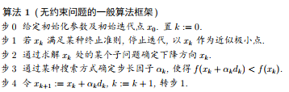

# 最优化理论

老师的讲课视频在 B 站[BV1nB4y137j9](https://www.bilibili.com/video/BV1nB4y137j9)。
主要分为数学基础、局部最优化问题求解和全局局部最优化问题，只讲了局部的部分。

- 绪论
- 单变量优化问题——线搜索
  - 单峰区间的确定
  - 黄金分割法
  - 牛顿法
  - 抛物线法
  - 非精确线搜索方法
- 多变量优化问题
  - 梯度法
  - 共轭梯度法
  - 牛顿法
  - 拟牛顿法
- 约束优化问题
  - 约束问题的最优性条件
  - 可行方向法
  - 梯度投影法、简约梯度法
  - 罚函数法
  - 乘子法

## 绪论

优化问题的表述：在一定的约束下，调整一组可变参数 x，使设计目标 f(x)达到最小值（或最大值）。
数学表述可以表示为：

$$
min\ f(\vec{x})\ s.t.\ \vec{x} \in K
$$

- `s.t.` 是数学中 subject to (such that) 的缩写，表示受约束的意思
- $f(\vec{x})$ 是目标函数（实值函数）
- $\vec{x}$为参数向量，$K$为可行域，即参数能够许可的取值范围

进而可以将最优化问题细分为：

- **线性规划和非线性规划**问题：可行集是有限维向量空间的子集
- **组合优化或网络规划**：可行集中的元素是离散的
- **动态规划**：可行集是一个依赖时间的决策序列
- **最优控制**：可行集是无穷维空间中的一个连续子集

线性最优化问题（线性函数，线性约束）的情况，最有情况出现在端点。
课程考虑**非线性规划/优化**：

$$
\begin{align}
        & min\ f(\vec{x}) \\
\ s.t.\ & h_i(\vec{x})=0,i=1,\dots,l, \\
	& g_i(\vec{x})<0,i=1,\dots m, \\
\end{align}
$$

### 最优化问题求解的一般思路

无约束问题的一般算法框架：

1. step 0: 给定初始化参数及初始迭代点$x_0$, 置$k:=0$
2. step 1: 若$x_k$满足某种终止准则，停止迭代，以$x_k$作为极小点
3. step 2: 通过求解$x_k$处的某个子问题确定下降方向$x_k$
4. step 3: 通过某种搜索方式确定步长因子$\alpha_k$，使得$f(x_k+\alpha_k d_k)<f(x_k)$
5. step 4: 令$x_{k+1}=x_k+\alpha_k d_k$，$k:=k+1$，转步 1

## 最优化问题的数学基础

### 线性代数

线性代数的核心内容是 $Ax=b$ 线性代数方程组解的存在性问题，以及如何求解他的问题，
以及这样的数学结构的问题。

- **矩阵行**的含义，A 的每一行是平面线的法向量（线的表达式系数，二维情况），n 个法向量互相不相关，那么方程有唯一解，相关则可能有无数解（共线）或没有解（平行）
- **矩阵列**的含义，相当于 x 是 A 的列向量的加权系数，加权组合结果为 b
- **矩阵行列式**：$Ax=b$， 向量 x 被 A 左乘后，变成了向量 b，称为线性变换，矩阵 A 的行列式的绝对值表示经过该矩阵变换前后图形的面积之比；符号表示该图形变换后法向是否翻转了
- **矩阵的秩**：将图形变化为线（秩为 1），面（秩为 2），体（秩为 3）
- **矩阵的逆**：一一映射才有逆，行列式为 0 时，矩阵没有逆

#### 范数

迭代求解过程中，如何判断点序列是否收敛，需要通过度量来衡量，
通常用范数来定义这个度量：

> “言为士则、行为世范”出自南朝宋刘义庆著《世说新语》开篇《德行第一》的第一则第一句，
> 意思是说言行足以为士人的法则、举世的示范。

向量的范数必须满足以下条件：

- 非负性 $\Vert x\Vert \geq 0$, $\Vert x\Vert =0, iff x=0$
- 线性性 $\lambda \Vert x \Vert =\lambda \Vert x \Vert $
- 三角不等式（又叫广义加）$\Vert x+y \Vert \leq \Vert x \Vert +\Vert y \Vert$

常用向量的 p 范数，$\Vert x \Vert_p=(\sum_{i=1}^{n} |x_i|^p)^\frac{1}{p}$。

$$
\lim_{p\to\infty} \Vert x \Vert^p
=\Vert x\Vert _{max} \lim_{p\to\infty} \left(\sum_{i}(\frac{\Vert x \Vert}{\Vert x\Vert _{max}})^p\right)^\frac{1}{p}
$$

由于$1 \leq\sum\limits_{i}(\frac{\Vert x \Vert}{\Vert x\Vert _{max}})^p\leq n$，根据夹逼原理可以得到极限部分为 1，另一个思路是求和里面只有一个底数为 1，其他均小于 1，可以得到结果。

**矩阵范数**，也需要满足非负性，线性性以及三角不等式。为了体现向量的乘法，增加乘法性质。进一步要求相容性：

- 乘法性质 $\Vert AB\Vert \leq \Vert A \Vert \Vert B \Vert$
- 相容性质 $\Vert Ax \Vert \leq \Vert A \Vert \Vert\vec{x}\Vert$

矩阵范数$\Vert \cdot \Vert _{\mu}$如果满足下列条件，则称为由向量范数的诱导范数（诱导算子）。

$$
\Vert A \Vert_\mu =sup_{x\neq0} \frac{\Vert Ax \Vert }{\Vert x \Vert}=max_{x=1}\Vert Ax \Vert
$$

矩阵范数表示单位圆/球/超球面上的所有向量 x 经过线性变换后得到的所有向量 Ax 中最长的那个的范数，
或者说表示任向量经过矩阵 A 所代表的线性变换后得到的所有向量中最长的那个的范数与原向量 x 的范数的比值。

- 矩阵范数是矩阵长度（大小）的度量
- 可以用来判断矩阵是否相等，判断两个矩阵之间的距离
- 矩阵范数可以表达经过变换之后向量范数大小的变化

各种范数之间具有等价性：

1. 设$\Vert \cdot \Vert$和$\Vert \cdot \Vert'$是定义在$R^n$上的两个向量范数，则存在两个正数$c_1,c_2$，对所有$x\in R^n$ 均成立：$c_1 \Vert x\Vert\leq \Vert x \Vert' \leq c_2\Vert x \Vert$
2. 设$\Vert \cdot \Vert$和$\Vert \cdot \Vert'$是定义在$R^{n\times n}$上的两个两个范数，则存在两个正数$c_1,c_2$，对所有$x\in R^n$ 均成立：$c_1 \Vert A\Vert\leq \Vert A \Vert' \leq c_2\Vert A \Vert$

#### 向量 1 范数推导矩阵列和范数

$$
\begin{align*}
\Vert A \Vert_1
&= \max_{x\neq 0} \frac{\Vert Ax \Vert_1}{\Vert x \Vert_1} \\
\Vert Ax\Vert_1
&=\sum_{i=1}^{n}\left|\sum_{j=1}^{n}a_{ij}{x_j}\right|
\leq \sum_{i=1}^{n}\sum_{j=1}^{n}|a_{ij}{x_j}|\\
&\leq \sum_{i=1}^{n}\sum_{j=1}^{n}|a_{ij}||{x_j}|
\leq \max_{1\leq j \leq n}(\sum_{i=1}^{n}|a_{ij}|)\cdot \sum_{j=1}^{n}|x_j|\\
\end{align*}
$$

#### 向量无穷范数推导矩阵行和范数

$$
\begin{align*}
\Vert A \Vert_1
&= \max_{x\neq 0} \frac{\Vert Ax \Vert_1}{\Vert x \Vert_1} \\
\Vert Ax\Vert_1
&=\max_{i=1,\dots,n}\left|\sum_{j=1}^{n}a_{ij}{x_j}\right|
\leq\max_{i=1,\dots,n}\sum_{j=1}^{n}|a_{ij}{x_j}|\\
&\leq \max_{i=1,\dots,n}\sum_{j=1}^{n}|a_{ij}||{x_j}|
\leq \max_{1\leq i \leq n}(\sum_{i=1}^{n}|a_{ij}|)\cdot \sum_{j=1}^{n}|x_j|\\
\end{align*}
$$

#### 向量 2 范数推导矩阵谱范数

$$
\|A x\|_2^2=x^T A^T A x=(H x)^T \operatorname{diag}\left(\lambda_i\right)(H x)=\sum_{i=1}^n \lambda_i y_i^2 \leq\left(\max _{1 \leq i \leq n} \lambda_i\right)\|y\|_2^2 .
$$

**以上推导省略等于号情况**，详细推导可以看[模糊计算士](https://www.cnblogs.com/fanlumaster/p/14509223.html)

### 多元函数

一维泰勒展开

$$
f(x)\approx f_0(x)
=f(x_0)+
\textcolor{red}{\left.\frac{\partial f}{\partial x}\right|_{x=x_0}}(x-x_0)
+\frac{1}{2}\textcolor{red}{\left.\frac{\partial^2 f}{\partial x^2}\right|_{x=x_0}}(x-x_0)^2
$$

二维展开

$$
f(\vec{x})\approx f_0(\vec{x})
=f(\vec{x}_0)+
\textcolor{red}{\left.\nabla f\right|_{\vec{x}=\vec{x}_0}}(\vec{x}-\vec{x}_0)
+\frac{1}{2}(\vec{x}-\vec{x}_0)^T\textcolor{red}{\left.\nabla^2 f\right|_{\vec{x}=\vec{x}_0}}(\vec{x}-\vec{x}_0)
$$

若函数 f(x)连续可微，则

$$
f(\vec{x})\approx f_0(\vec{x})
=f(\vec{x}_0)
+\textcolor{red}{\left.\nabla f\right|_{\vec{x}=\vec{x}_0}}(\vec{x}-\vec{x}_0)+\textcolor{green}{o(\Vert \vec{x}-\vec{x}_0\Vert)}
$$

若函数 f(x)二次连续可微，则

$$
\begin{align*}
f(\vec{x})\approx f_0(\vec{x})
&=f(\vec{x}_0)\\
&+\textcolor{red}{\left.\nabla f\right|_{\vec{x}=\vec{x}_0}}(\vec{x}-\vec{x}_0)\\
&+\frac{1}{2}(\vec{x}-\vec{x}_0)^T\textcolor{red}{\left.\nabla^2 f\right|_{\vec{x}=\vec{x}_0}}(\vec{x}-\vec{x}_0)\\
&+\textcolor{green}{o(\Vert \vec{x}-\vec{x}_0\Vert^2)}\\
\end{align*}
$$

进一步可以推广到函数 $F:R^n\to R^m$ 的情况，有时称 F 的 Jacobi 矩阵的转置称为 F 的转置。

### 凸集与凸函数

- **凸集**：对于集合$D\subset R^n$，对任意$x,y\in D$和任意实数$\lambda \in [0,1]$，均有：$\lambda x +(1-\lambda)y \in D$，则称集合 D 为凸集。
- **凸函数**：设函数$f:D \subset R^n \to R$，D 为凸集
  1. 对任意$x,y\in D$和任意$\lambda\in(0,1)$，都有$f(\lambda x +(1-\lambda)y)\leq\lambda f(x) + (1-\lambda) f(y)$，则称 f 为**凸函数**
  1. 对任意$x,y\in D$和任意$\lambda\in(0,1)$，都有$f(\lambda x +(1-\lambda)y)<\lambda f(x) + (1-\lambda) f(y)$，则称 f 为**严格凸函数**
- **凸化**：工程中问题大多数是非凸问题，将求解域限制在小范围内，称为凸化。
- **凸优化**：考虑非线性规划：min f(x) s.t. $g_i(x)\leq 0. i=0,\dots,p$，f 和 gi 均为凸函数。也可以表述为：可行集为凸集，目标函数为凸函数的优化问题。

对于凸优化问题，目标函数的任一局部极小值点都是其全局极小值点。**证明**：假设可行域内的一个局部极小值点为$x^\star$，那么在它的一个领域内，$x^\star$应该是极小值点，而又有一个全局极小值点小于他，由于凸集的性质，那么总存在连线上的一点在这个领域内，由于凸函数的性质，总存在点使得该点在领域内又小于$x^\star$，矛盾。

### 判断凸函数

### 评价方法优劣的标准

- **收敛性**：
  - 是全局收敛还是局部收敛
  - 收敛速度
- 适用性
- 方法效率：多少步，每一步需要计算的时间

### 迭代的终止条件

1. 位移的绝对误差（或相对误差）充分小
2. 目标函数的绝对误差（或相对误差）充分小
3. 目标函数的梯度的范数充分小$\Vert \nabla f(x_k) \Vert \leq \epsilon$

---

## appendix

